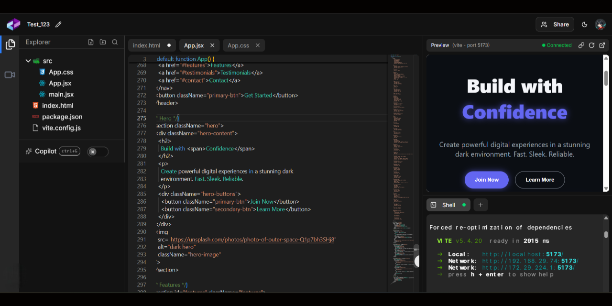

<h1 align="center" style>
  <br>
  <a href="https://code-connect-site.vercel.app" target="_blank"></a>
  <br>
  Code Connect
  <br>
</h1>

<h4 align="center">A live code editor powered by instant sync and seamless teamwork.</h4>

<p align="center">
  <a href="" target="_blank">
      
  </a>
  <a href="https://choosealicense.com/licenses/apache" target="_blank">
      
  </a>
  <a href="" target="_blank">
      
  </a>
  <a href="" target="_blank">
    
  </a>
</p>

<p align="center">
  <a href="#key-features">Key Features</a> •
  <a href="#how-to-use">How To Use</a> •
  <a href="#how-to-contribute">How To Contribute</a> •
  <a href="#technologies">Technologies</a> •
  <a href="#license">License</a>
</p>

<p align="center">
  
</p>

🌐 **Live Demo**🔗 [code-connect-site.vercel.app](https://code-connect-site.vercel.app)

## Key Features

-   Real-Time Code Collaboration – Multiple users can edit the same codebase simultaneously with instant synchronization.

-   Live Video & Audio Chat – Built-in conferencing keeps communication seamless while coding together.

-   Multi-Language Code Editor – Supports popular programming languages with syntax highlighting and auto-completion.

-   Session Rooms – Create and join coding sessions via unique project links for pair programming or group projects.

-   Role-Based Access – Manage permissions for hosts, participants, and viewers easily.

-   Integrated Terminal – Run commands directly inside the collaborative workspace.

-   Live Preview – Instantly view code output and changes as you type, enabling faster debugging and iteration.

-   Responsive Interface – Works flawlessly on desktops, tablets, and mobile devices.

-   Secure & Scalable – Built with authentication, encrypted communication, and scalable backend architecture.

## Architecture

### High-Level Structure

```
code-connect/
├── frontend/           # Next.js 15 client application
├── backend/
│   ├── server/        # Node.js/Express WebSocket server
│   ├── database/      # Cloudflare D1 database worker
│   └── storage/       # Cloudflare R2 storage worker
```

## How To Use

To clone and run this application, you'll need [Git](https://git-scm.com) and [Node.js](https://nodejs.org/en/download) (which comes with [npm](http://npmjs.com)) installed on your computer. From your command line:

##### Clone this repository

```bash
$ git clone https://github.com/kunaldasx/code-connect
$ cd code-connect
```

##### Frontend setup (Terminal 1)

```bash
$ cd frontend
$ npm install
$ cp .env.example .env # Configure variables
$ npm run dev
```

##### Backend setup (Terminal 2)

```bash
$ cd backend/server
$ npm install
$ cp .env.example .env  # Configure variables
$ npm run dev
```

##### Cloudflare D1 Setup

```bash
$ cd server/database
$ npm install
$ npx wrangler login
$ npx wrangler d1 execute codeconnect-db --local --file=./drizzle/0000_lumpy_nekra.sql
$ npm run deploy
```

##### Cloudflare R2 Setup

```bash
$ cd server/storage
$ npm install
$ npx wrangler login
$ npm run deploy
```

## How to Contribute

1. Clone repo and create a new branch: `$ https://github.com/kunaldasx/code-connect -b name_for_new_branch`.
2. Make changes and test
3. Submit Pull Request with comprehensive description of changes

## Emailware

Crusto is an [emailware](https://en.wiktionary.org/wiki/emailware). Meaning, if you liked using this app or it has helped you in any way, I'd like you send me an email at <kunaldasx@gmail.com> about anything you'd want to say about this software. I'd really appreciate it!

## Technologies

This software uses the following technologies:

-   **Frontend**: Next.js 15, React 19, TypeScript, TailwindCSS
-   **Backend**: Node.js, Express, Socket.IO for real-time communication
-   **Database**: Cloudflare D1 (SQLite) with Drizzle ORM
-   **Storage**: Cloudflare R2 for file storage
-   **Real-time Collaboration**: Liveblocks + Y.js for operational transforms
-   **Authentication**: Clerk
-   **Code Editor**: Monaco Editor with syntax highlighting
-   **Video/Audio**: WebRTC with Simple Peer

## Support

If you like this project and think it has helped in any way, consider buying me a coffee!

<a href="" target="_blank"></a>

## License

MIT

---

> 🌐 [Visit my website →](https://kunaldasx.vercel.app/)<br>
> 🖥️ [GitHub](https://github.com/kunaldasx) &nbsp;&middot;&nbsp;
> 💼 [LinkedIn](https://www.linkedin.com/in/kunaldasx/) &nbsp;&middot;&nbsp;
> 🐦 [Twitter / X](https://x.com/Kunaldasx) &nbsp;&middot;&nbsp;
